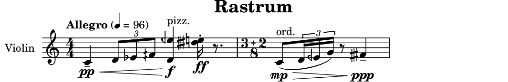
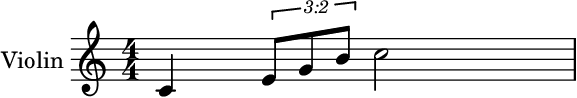
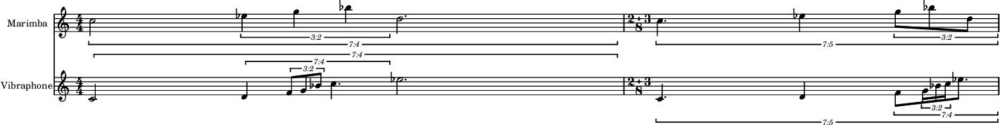

# Rastrum

Music notation for SuperCollider: a score model with LilyPond,
MusicXML, GUIDO and ScoreJSON writers.

Rastrum builds a score tree directly or from proportional rhythm
(RTM), reads and rewrites one in the terms a musician would use, and
writes LilyPond, MusicXML, GUIDO, ScoreJSON, SuperCollider `Event`s,
or patterns.

`ScorePrepare` rewrites durations no single note head can spell into
tied, notatable leaves. `Rastrum.render`, `Rastrum.preview`,
`Rastrum.writeMusicXML` and `Rastrum.writeGuido` also derive ordinary
beam groups by default. `Rastrum.writeJSON` doesn't, because a derived
beam is engraving policy rather than a score fact, so it stays off the
wire.

ScoreJSON is a proposed interchange format for scores, versioned and open to
any project that wants it. It lets two programs exchange a score without either
of them adopting the other's model. metasonic-score, an unreleased Haskell
project, is currently using it that way.

**Status: experimental.** The API may still change.

## Install

`Rational` supplies the exact durations the model is built on, so it comes first
either way:

```supercollider
Quarks.install("Rational");
```

Then Rastrum, as a quark:

```supercollider
Quarks.install("https://github.com/smoge/Rastrum");
```

Or by cloning it into SuperCollider's extensions directory, which is compiled at
startup. Evaluate this to find that directory on your platform:

```supercollider
Platform.userExtensionDir;    // ~/.local/share/SuperCollider/Extensions, on Linux
```

```bash
git clone https://github.com/smoge/Rastrum ~/.local/share/SuperCollider/Extensions/Rastrum
```

Then recompile the class library. A clone is not a quark, so nothing reads
`Rastrum.quark` and its dependency is yours to install, which is what the first
line above does. To uninstall, delete the directory and recompile.

### LilyPond

LilyPond is needed only to engrave or preview. MusicXML, GUIDO, ScoreJSON,
events, patterns and model operations need no LilyPond at all.

Rastrum searches for `lilypond` once at startup and remembers what it found:
```supercollider
Rastrum.lilypondPath;      // "/usr/bin/lilypond"
```

If that is nil, or points at the wrong one, set it:

```supercollider
Rastrum.lilypondPath = "/path/to/bin/lilypond";
```

The search uses a login shell, so Homebrew and other shell-configured
paths are visible. If discovery fails, put the assignment in your
`startup.scd`.

## Minimal Example

```supercollider
~score = MusicScore.oneStaff([Measure("4/4", "c4 d4:grace{db8} e4 f4")], "Violin");
Rastrum.render(~score, "example");
```

That writes `example.pdf` and `example.midi`. The grace prints before the host
note and adds no bar time.

## Another Example

```supercollider
(
~m1 = Measure("4/4",                                  // the pp into that f
    "cresc[c4:pp:tenuto 3:2[d8 eb8 f+8] <d e-'>4:text{pizz.}:f] "
    "<e' d#+'>16:ff:stac r8.")
    .metronome("4", 96, text: "Allegro");
~m2 = Measure.proportions("5/8[3+2]", "(1 (1 (1 1 1)) -1 2)",
    "c:mp:text{ord.} d e- g f#+:ppp:tenuto");   // bowed again, after the pizz.

~phrase = ScoreSelection(~m2).runs.first;            // the run before the rest

Spanner.slur(Spanner.beam(~phrase));                 // beamed, and under a slur
Spanner.diminuendo(ScoreSelection(~m2).pitched);     // mp fading to ppp

~score = MusicScore.oneStaff([~m1, ~m2], "Violin", \treble, "Rastrum");
)

Rastrum.render(~score, "study");              // LilyPond -> PDF and .midi
Rastrum.writeMusicXML(~score, "study");       // MusicXML file
Rastrum.writeJSON(~score, "study");           // ScoreJSON file
Rastrum.writeGuido(~score, "study");          // GUIDO file
```



That is the page `render` writes: the crescendo from `pp` into the
pizzicato chord, the marked triplet, the quarter-tones, the metronome
mark, the `ff` staccato sixteenth and the dotted rest completing its
beat, and the grouped 5/8 bowed again, slurred and fading from `mp` to
a held `ppp` arrival, each from the line above that says it.

A sforzando is its own kind of marking rather than another dynamic,
and its name states the level the attack lands on: `smpz`, `smfz`,
`sfz` and `sffz` for `mp`, `mf`, `f` and `ff`. A dynamic written
beside one is what the note settles onto for the rest of its length,
and a score prints the pair as one glyph.

```supercollider
MN("c4:sfz");        // an attack at the level its name states, f here
MN("c2:sfz:pp");     // the compound, settling onto pp for the rest of the note
```

A bar is one string and the spans it cannot say are objects over it. A
written `cresc[...]` group ends on leaves and holds whatever stands
between them, which is how the hairpin here reaches across the triplet
without naming a single leaf. A span reaching past what one bar can
see is still said with a `Spanner` helper on the leaves it joins. A
beam against a bracket is authorial too, which is why the eighth is
beamed into the triplet here rather than by `AutoBeam`.

The second bar states its rhythm as proportions and its pitches as a
list, which is what lets a cell be rotated or re-metered without
touching a pitch. That list says what is on a leaf as well as which
pitch it is, in the same suffixes the bar grammar reads, so a dynamic
is spelled one way here and there. What it cannot say is how long
anything lasts, since the shares already said that.

Spans are asked for in musical terms. `ScoreSelection` reads a tree
the way a player reads a part, so one is attached to the run before
the rest rather than to a counted position, and a group helper takes
that selection directly. Each one answers its run, which is why the
beam and the slur over one phrase are a single line.

Facade methods prepare and validate by default, and `render`,
`preview`, `writeMusicXML` and `writeGuido` also derive ordinary
beams. Raw writers return strings and leave both to the caller.

### Three Input Styles

All three styles build the same score tree. Use core constructors when
code is generating or transforming music, specialized parsers when
writing ordinary notation, and quasiquoters when you want that parser
syntax without the quoted strings.

**(a) Core constructors**, spelling out every object:

```supercollider
~core = MusicScore.oneStaff([
    Measure(Meter(4, 4), [
        MusicNote(MusicPitch(\c), Duration.quarter)
            .dynamic(\mp)
            .articulation(\tenuto),
        Tuplet.ratio(3, 2, [
            MusicNote(MusicPitch(\d), Duration.eighth),
            MusicNote(MusicPitch(\e, \flat), Duration.eighth),
            MusicNote(MusicPitch(\f, \quarterSharp), Duration.eighth)
        ]),
        Chord([
            MusicPitch(\g), MusicPitch(\b), MusicPitch(\d, octave: 5)
        ], Duration.quarter).text("pizz."),
        MusicNote(MusicPitch(\c, octave: 5), Duration.quarter)
            .dynamic(\f)
    ]).metronome("4", 96, text: "Allegro"),
    Measure.proportions(
        Meter.grouped(5, 8, [2, 3]),
        [1, [1, [1, 1]], -1, 2],
        "c d e g")
], "Violin", \treble, "Study I");
```

**(b) Specialized parsers**, reading the same facts from the slot they fill:

```supercollider
~parsed = MusicScore.oneStaff([
    Measure("4/4",
        "c4:mp:tenuto 3:2[d8 eb8 f+8] <g b d'>4:text{pizz.} c'4:f")
        .metronome("4", 96, text: "Allegro"),
    Measure.proportions("5/8[2+3]", "(1 (1 (1 1)) -1 2)", "c d e g")
], "Violin", \treble, "Study I");

MusicPitch("c-[5]");        // pitch spelling
Duration("4.");             // dotted quarter
Meter("5/8[2+3]");          // grouped meter
MN("c-4:mf:staccato");      // one marked note
Chord("<c+ e g>2:ff");      // one marked chord
```

**(c) Quasiquoters**, which reuse those same parsers. Start the
preprocessor in one evaluation of its own:

```supercollider
Rastrum.startQuasiquoter;
```

A file or a selection is preprocessed whole before any of it runs, so
a quasiquote block in the same evaluation as the line that turns it on
is still raw text. Evaluate the start first, then the blocks:

```text
~quotedBar = [measure|
    4/4 c4:mp:tenuto 3:2[d8 eb8 f+8] <g b d'>4:text{pizz.} c'4:f
|];
~quotedCell = [rtm| (1 (1 (1 1)) -1 2) |];
~quotedNote = [note| c-[5]8.:mf |];
~quotedRun = [run| c4 r4 <e g>2 |];        // an Array of leaves

// Several bars, `|` between them, the meter stated only where it changes.
~quotedBars = [measures| 4/4 c4 d4 e2 | c4 r4 e2 | 3/4 c4 d4 e4 |];

~quoted = MusicScore.oneStaff([
    ~quotedBar.metronome("4", 96, text: "Allegro"),
    Measure.proportions("5/8[2+3]", ~quotedCell, "c d e g")
], "Violin", \treble, "Study I");
```

A syntax error near KEYBINOP usually means the preprocessor was not
started first.

Once it is running, sclang reads a quasiquote block exactly as it
reads any other sclang code, because the block is rewritten into
ordinary constructor calls before the compiler sees it. A syntax
highlighter works one step earlier, on the file as you wrote it, so it
meets a block that has not been rewritten yet. That is why
highlighting can lose track around raw blocks, especially when a block
contains apostrophe register marks or sits inside a larger expression.

An editor mode could be adapted to read the block syntax as well, and
nothing in the quasiquoter stands in the way. It is just not this
quark's layer. Rastrum ships classes and a preprocessor, not editor
modes.

Spanners, voices and bar-level objects stay ordinary objects around
compact leaves:

```supercollider
~phrase = Measure("3/4", [
    Voice(Spanner.slur("c4 d4 e4"), "upper"),
    Voice(Spanner.crescendo("<g b>4 <a c'>4 <b d'>4"), "lower")
]);
```

The bar parser reads a run of tokens: a pitch and the note value it
lasts, `r` for a rest, `'` and `,` for register, `<c e g>4` for a
chord, a trailing `~` for a tie, `3:2[c4 d4 e4]` for a bracket, and
`crescendo[c4 d4]` for a hairpin over a run, which may hold a bracket
between its ends. Above a leaf and its brackets, everything stays an
object: voices, slurs, beams, directions and barlines.

A written line puts the meter first, as in `"4/4 c4 d4 e2"`, and
several bars are separated by `|` with the meter stated only where it
changes. A semicolon after the meter is optional. Use it where it
improves readability.

That form suits a bar you already know. When the rhythm is
proportional, generated or transformed, write the shares instead and
let the meter work out the note values and any bracket.

## Design

There is one model and, currently, four writers over it. The score
tree carries no writer syntax at all, so a new output format is a new
`ScoreWriter` subclass and nothing else. Durations, tuplets, beams,
directions and pitches stay score facts, and each writer spells them
itself.

The LilyPond and MusicXML writers both shipped in the first commit,
and that is a correction of my own earlier work. LilyCollider was
built on LilyPond's representation and the FOMUS quark on Fomus's, and
in both the host format's model became the library's model by default
rather than by decision. What LilyPond could not say, I did not
reject. I never noticed it was missing. A second backend from the
start is what makes that visible. A concept only one format can
express shows up the day it is added, rather than years later when the
model would have to be rebuilt around it.

`GuidoWriter` came much later and needed no change to the model. It is
also the narrowest of the four. Every mapping was checked against a
real GUIDO engine first, and the handful it cannot draw are refused by
name rather than approximated.

### Proportional Rhythm

A bar can be written as shares of its span rather than as durations,
which is the shorter and more musical of the two routes.

This is the RTM shape, a proportional rhythm tree: a number is a
share, a negative number is silence, and `[weight, subdivisions]`
divides a share further. For example:

```supercollider
RhythmTree.measure(Meter(4, 4), [1, [1, [1, 1, 1]], 2],
    [\c, \e, \g, \b, [\c, 5]]);
```

A cell can also be written the way RTM has always been written, which
is the spelling to reach for once the nesting is what makes a line
hard to read:

```supercollider
RhythmTree.measure("4/4", "(1 (1 (1 1 1)) 2)", "c e g b c'");
```



The array stays the one to reach for when the structure itself is the
subject: paths, rewrites, and what a share is made of.

After `Rastrum.startQuasiquoter` has been evaluated, the same cell can
be written without the String quotes:

```text
~cell = [rtm| (1 (1 (1 1 1)) 2) |];
RhythmTree.measure("4/4", ~cell, "c e g b c'");
```

`Measure.proportions` is `RhythmTree.measure` under the result's name.
Use `Measure.proportions` when the subject is the bar, and
`RhythmTree.measure` when the subject is the rhythm. A meter can be
written the way it prints too, as in `Meter("4/4")`, or with explicit
subdivisions, as in `Meter("5/8[2+3]")`.

The note values and any tuplet bracket follow from the shares and the
meter. That derivation is meter-aware on purpose. Three equal shares
of a 3/4 bar are plain quarters and three of a 4/4 bar need a bracket,
so a blind power-of-two rule would print a spurious one:

```supercollider
RhythmTree.chooseDivisor(Duration(3, 4), [1, 1, 1]);   // 3, plain quarters
RhythmTree.chooseDivisor(Duration(1, 1), [1, 1, 1]);   // 2, a 3:2 over halves
```

Shares are relative, so a common factor is removed first and the same
rhythm written coarsely or finely is one notation. A duration the
shares imply that no note head can spell is built as it is and left
for the preparation pass to tie.

`RhythmCell` is that same list held as a value, so it can be rotated,
scaled, muted, reversed or rewritten one share deep without the caller
having to know which entries are nested. Getting that wrong by hand is
silent, which is why the class exists:

```supercollider
RhythmCell([1, [2, [1, 3]]]).retrograde;   // RhythmCell([ [ 2, [ 3, 1 ] ], 1 ])
```

`replaceCellAt` is the same idea one step further: a cell can be grown
inside itself, and the note values still follow from the shares and
the meter. The upper staff below is the seed, the lower one is that
seed substituted into its own second share, and both are rotated a
step per bar.

```supercollider
~seed = RhythmCell("(2 (2 (1 1 1)) 3)");
~grown = ~seed.replaceCellAt([1], ~seed);

~plan = ["4/4", "5/8[2+3]"];

MusicScore.staves([
    (name: "Marimba", clef: \treble, measures: ~plan.collect { |meter, i|
        ~seed.rotated(i).measure(meter, "C' Eb' G' Bb' D'") }),
    (name: "Vibraphone", clef: \treble, measures: ~plan.collect { |meter, i|
        ~grown.rotated(i).measure(meter, "C D F G Bb C' Eb'") })
]);
```



Nothing in that is a special case. The brackets are what the shares
came to against each meter, and no depth was asked for anywhere.

### Pitches and Intervals

`MusicPitch` keeps its spelling. `MusicInterval` is the signed spelled
distance between two pitches, so transposition preserves letter
motion:

```supercollider
~third = MusicPitch(\e) - MusicPitch(\c);
(MusicPitch(\c) + ~third).letter;                  // e

~wideFourth = MusicInterval.named(\semiAugmented, 4);
~wideFourth.transpose(MusicPitch(\c)).accidental;  // quarterSharp
```

### Metric Weight

`Meter` carries more than the pair it prints. `levelOf` answers a
metric depth for any exact position, and that is what decides where a
tie may be cut and whether a rest is readable where it sits:

```supercollider
(0..7).collect { |i| Meter(4, 4).levelOf(Duration(i, 8)) };
// [0, 3, 2, 3, 1, 3, 2, 3]
```

`indispensability` is Clarence Barlow's ranking of how much each pulse
is needed for the meter to be heard as itself. It is composition
rather than notation, no writer reads it, and it is there to thin a
rhythm and keep its character. 3/4 and 6/8 hold the same six eighth
notes and rank them differently, which is Barlow's own argument:

```supercollider
Meter(3, 4).indispensability(Duration(1, 8));   // [ 5, 0, 3, 1, 4, 2 ]
Meter(6, 8).indispensability(Duration(1, 8));   // [ 5, 0, 2, 4, 1, 3 ]
```


### Preparation and Validation

Two passes stand between a tree you wrote and a page. They are
separate because they answer different questions.

`ScorePrepare` rewrites what no note head can spell. Five eighths is
not a note head, so it becomes two tied leaves, and where the note
starts decides how it is split. The music doesn't change: same
attacks, same sounding durations, only the heads a reader sees.

`Validator` refuses what doesn't add up. Full bars have to add up, a
bar short on purpose has to say where it sits, every voice has to fill
its bar, a tie has to reach the same pitch, spanner endpoints have to
pair up, directions have to land where a leaf begins, and closed
vocabularies stay closed.

```supercollider
ScorePrepare.run(Measure("4/4", "c*5/8 d*3/8"));   // one leaf became two tied
Validator.validate(Measure("4/4", "c4 d4"));   // refused: the bar is half full
```

The facade runs both before any writer. A raw writer runs neither, so
hand it `ScorePrepare.run(...)` yourself or it refuses the unprepared
tree rather than guessing.

 `Rastrum.render`, `Rastrum.preview`, `Rastrum.writeMusicXML` and
 `Rastrum.writeGuido` also derive ordinary beam groups.
 `Rastrum.writeJSON` doesn't, because a derived beam is engraving
 policy rather than a score fact, so it stays off the wire.

### Beams, Graces and Glissandi

A beam is authored as a spanner, `Spanner.beam("c8 d8 e8 f8")`, or
derived from the meter by `AutoBeam`. Deriving it once in the model
means every backend draws the same decision instead of each inferring
its own, and LilyPond's own inference is turned off for exactly that
reason.

```supercollider
~six = Measure.proportions("6/8", "(1 1 1 1 1 1)");
AutoBeam.run(~six);
AutoBeam.groupsIn(~six).collect { |group| group.size };   // [ 3, 3 ]
```

3+3 rather than 2+2+2, because 6/8 is compound and beaming it in pairs
would print a bar of 3/4 wearing the wrong time signature. A bar
beamed by hand is left exactly as written.

A grace is written and doesn't last. It hangs off the note it
ornaments rather than standing in the bar, so `graces` is not
`children` and nothing that sums written time ever reaches it. That is
what keeps every duration nonzero.

```supercollider
MN("c4").grace("b8");
MN("e4").acciaccatura("f16 g16");
Measure("2/4", "c4:grace{b8} e4:acciaccatura{f16 g16}");
```

The token is the same fact as a suffix, so one graced note doesn't take
its bar out of written form. Every leaf kind hosts a group.

A glissando connects neighboring attacks. In a chain, each pair gets
one line.

```supercollider
Measure("4/4", "gliss[c4 e4 d4] r4");
Measure("2/4", "gliss[<c e g>4 <d f a>4]");
```

Chord glissandi pair notes by written position, so both chords need the
same number of note heads.

### Layout Profiles

`LilyProfile` is LilyPond's engraving policy and nothing the model or
the other backends ever hear about: paper size, staff size, the
`\paper` and `\layout` blocks, from a closed and typed settings
vocabulary.

```supercollider
// [ default, complexRhythm, landscapeComplexRhythm, openComplexRhythm ]
LilyProfile.names;

Rastrum.preview(~score, "study-01", layout: \complexRhythm);
Rastrum.preview(~score, "study-01", layout: LilyProfile(\complexRhythm,
    (systemSpacing: 22, markupSystemPadding: 3)));
```

`\complexRhythm` adds proportional spacing, full brackets and complete
ratios. Use `\openComplexRhythm` for deeper nesting.

## Reading and Editing a Score

Everything above builds a tree and hands it somewhere.
`ScoreSelection` goes the other way and reads one in the terms you
would use out loud. Filters answer another selection, so they chain,
and accessors answer plain arrays.

```supercollider
~notes = ScoreSelection(~score).inStaff("Violin").notes;
[~notes.size, ~notes.offsets.first, ~notes.offsets.last];
```

A leaf alone doesn't say where it is, so a selection holds records:
the leaf plus the staff, bar, timeline and exact moment that make it
addressable. Offsets are `Duration`s, so a triplet quarter is a sixth
and not 0.1666.

A leaf is a note head, and a note is sometimes more than one of them.
`logicalTies` is the layer between a leaf and a note, so a note written as two
tied heads is asked about once:

```supercollider
~doubled = ScoreSelection(~score).inStaff("Violin").mapLogicalTies { |run|
    MusicInterval.named(\major, 3).transpose(run[\pitch]) };
```

Reading changes nothing. `mapLeaves`, `mapLogicalTies` and
`transposeBy` change a copy and hand it back, so the score you started
from stays where it was.

`ScoreEdit` is the checked way back in when you want an addressed edit
rather than a whole-selection transform. A run is read as a selection,
then one validated copy is built around the change. `replaceRun` keeps
one selected leaf for one replacement leaf, and `reshapeRun` keeps the
occupied time and lets the shape change. Both refuse edits that would
silently drop part of a tuplet, tie or spanner.

```supercollider
~loop = MusicScore.oneStaff([
    Measure("4/4", "c4 d4 e4 f4"),
    Measure("4/4", "g4 a4 b4 c'4")
], "Violin");

~span = ScoreSelection(~loop).inStaff("Violin")
    .inMeasure(1)            // bar indices count from zero
    .withinBar(0, "1/2");    // its first half

ScoreEdit.replaceRun(~loop, ~span, "a4 b4");
ScoreEdit.reshapeRun(~loop, ~span, "3:2[a8 b8 c'8] d4");
```

`ScoreLocator` bridges a clock moment to a selection, which is how an
outside position becomes an editable address. `ScoreDiff` observes two
scores and answers plain delta records, and `ScoreHistory` is an
immutable append-only log of them. All three are observational. There
is no patch application, undo or score reconstruction anywhere in
them.

`ScoreLocator` prepares by default, so a reading whose paths will be
edited asks for the tree as handed in.

```supercollider
~where = ScoreLocator(~loop, false).selectionAt(Duration(1, 4)).paths.first;
~after = ScoreEdit.replaceLeafAt(~loop, ~where, MusicRest(Duration.quarter));
~log = ScoreHistory.start(~loop).recorded(~after, "rest the second beat");

~where;              // [ 0, 0, 1 ]
~log.changeCount;    // 1
```

## Playback

The same tree also answers SuperCollider events, which is the fourth
output and the only one that isn't a String. A tie is not another
attack, so this interpretation follows sounding attacks rather than
written note heads: the 5/8 note prepared as two heads is one event.

Each event carries what a scheduler needs at the top level, and
everything Rastrum knows about it in one inert `\rastrum` payload,
where it cannot collide with a SynthDef control. One timeline is a
`Pbind`, several beginning together are a `Ppar`.

```supercollider
Rastrum.events(~score);         // an Array of Events
Rastrum.pbinds(~score);         // one Pbind per timeline
Rastrum.pattern(~score);        // a Ppar of them, score metronome marks included
Rastrum.play(~score, \default); // answers the player, so you can stop it
```

Structure is derived and interpretation is chosen. A score says "ff",
not an amplitude, and "staccato", not a note length, so what a mark is
worth to a synth lives in optional tables that nothing reaches unless
you ask:

```supercollider
~map = PlaybackMap.new
    .instrumentAt(0, 0, \default)   // staff 0, its first timeline
    .useDynamics                    // ppppp..fffff maps to \amp
    .useArticulations;              // staccato, tenuto maps to \legato

~map.pattern(~score);
```

Tempo is its own table, because a tempo governs a moment rather than a
note and may land where no note begins. Prose has no speed until you
map it, and a prose mark with no entry is refused rather than played
at a guessed speed. A printed metronome mark is a number already, so
it bypasses the map entirely and reaches every surface, playback
included.

```supercollider
~speeds = PlaybackTempoMap.new.tempo("Allegro", 132);
Ppar([
    ~speeds.tempoPattern(~score),            // first, so it reaches the clock
    Rastrum.pattern(~score, tempo: false)    // before the note due with it
]).play;
```

`PlaybackProfile` composes the optional layers in one stated order and
answers which keys the result carries. Every slot is optional, and an
empty profile is ordinary structural playback, which is what makes it
safe to start from one and add a layer at a time.

```supercollider
~profile = PlaybackProfile.new
    .playbackMap_(PlaybackMap.new.useDynamics.useHairpins)
    .graceMap_(PlaybackGraceMap.new)
    .controlMap_(PlaybackControlMap.new.panAt(0, 0, -0.5));

~profile.carriedKeys;
~profile.pattern(~score);
```

## Interchange

ScoreJSON is the proposal, and `ScoreJSONWriter` and `ScoreJSONReader`
are Rastrum's ends of it: a tagged tree with a `"type"` discriminator,
exact rationals as `[numerator, denominator]` pairs, and no floats
except `cents`. Nothing in the shape is particular to Rastrum, which
is the point. Any project that can write the tree can hand a score to
any project that can read one.

Current ScoreJSON documents say `"format":"score-json"` and
`"version":31`, and the version is bumped on any change to the schema.

Rastrum reads and writes it. metasonic-score, an unreleased Haskell
project by the same author that also emits LilyPond and MusicXML,
decodes and checks it.


```json
{"format":"score-json","version":31,"type":"score","title":"Study I",
 "staves":[{"type":"staff","name":"Violin","clef":"treble","measures":[
   {"type":"measure","meter":[4,4],"elements":[
     {"type":"tuplet","multiplier":[2,3],"elements":[
       {"type":"note","pitch":{"step":0,"alter":[0,1],"octave":4,"cents":0.0},
        "duration":[1,2],"tiesToNext":true},
       {"type":"note","pitch":{"step":0,"alter":[0,1],"octave":4,"cents":0.0},
        "duration":[1,2]}]}]}]}]}
```

Only whole scores are documents. A bare measure or staff is refused
rather than written as a fragment. LilyPond, MusicXML and GUIDO are
one-way document views. ScoreJSON is the one that reads back, so a
score returned from it is an ordinary score again and the same writers
work on it.

## Learning More

See [tutorial.scd](tutorial.scd) for more API details.

## License

[GPLv3](LICENSE).
